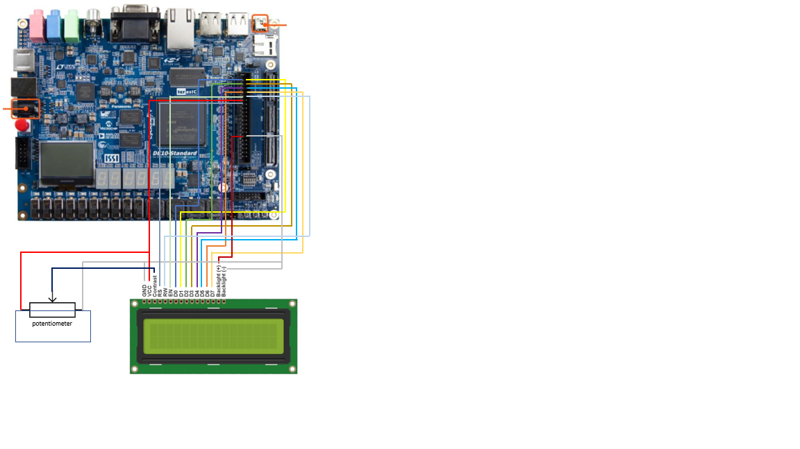
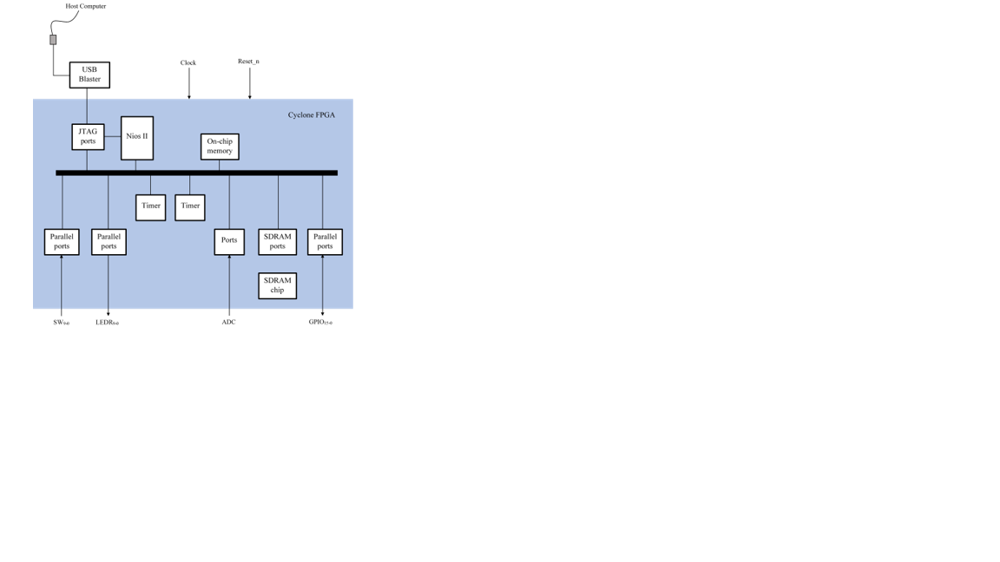
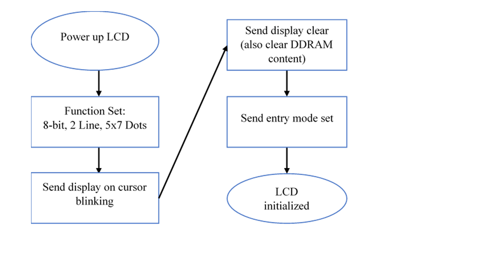
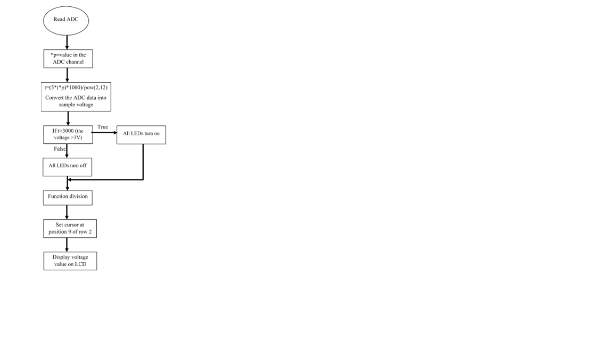
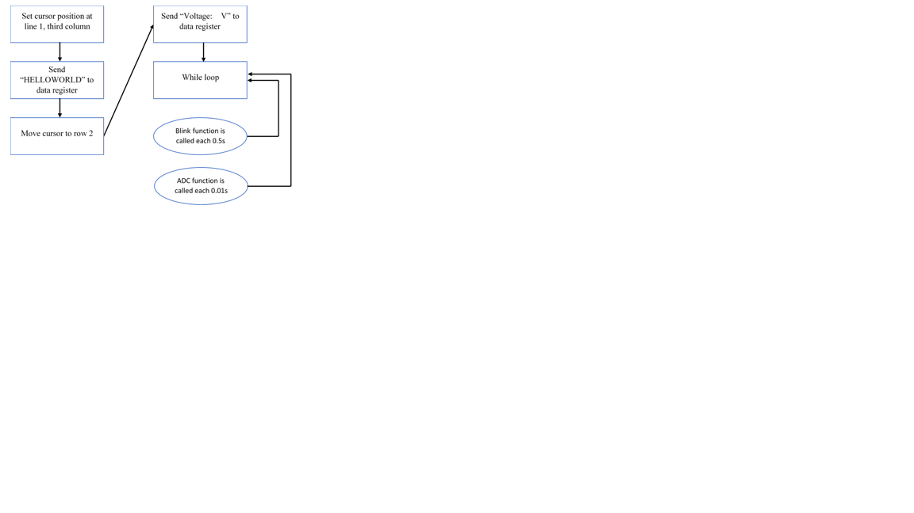

# DE10-Standard_miniproject

A system using Nios II in kit DE10 to connect  LCD 16x2. This system can do following tasks:

- When SW0 is ON, LCD blink the sentence &quot;Hello World !!!&quot; in the middle of row 1 of LCD 16x2 with frequency 1Hz. (Using timer) .

- When SW1 is ON, system read Voltage on channel of ADC and display on LCD with format: &quot;Voltage: xx.xV&quot;. When the voltage \&gt;3V, all LEDs turn on.

- When SW0 and SW1 are on, all LEDs blinks from left to right.

- When SW0 and SW1 are off, turn off.

Figure 1. Hardware connection
 

Figure 2. Overall diagram blocks. 
In this mini project, we build a microcontroller with Havard architecture which means data and program are stored in separate memory. SDRAM peripheral is used to store data memory. On-Chip Memory is used to store program memory.
-	Parallel ports (GPIO): used as output pins to interface with LCD.
-	Timers: hardware block that counts clock sequence (0 - 232 ticks) and generate interrupt requests (alarm).
-	Ports: A/D Converter available on DE10 Standard board to read value that had been passed through a potentiometer 

Figure 3. LCD 16*2 set up 
To achieve LCD display, we not only need to send data but also need to send command to clear display, set the position of the cursor, set entry mode and so on. In general, data or command is read on the falling edge of the enable bit. We can control LCD following these 3 steps:
1)	Set Enable to HIGH
2)	Set RS and D0 – D7 desired value
3)	Set Enable to Low

Figure 4. ADC component 
This function is to read the value of rheostat at channel 2 of ADC block available in DE10 standard board when only SW1 is on. 

Figure 4. Main program 
In main function of this program,  
0x38: Function Set: 8-bit, 2 Line, 5x7 Dots. We format LCD display. 
0x0F: Display on Cursor blinking. We can see cursor blinks on LCD afetr this code. 
0x01: Clear Display (also clear DDRAM content) before working with LCD. 
0x83: at row 1, begin at position 3, because we want “HELLOWORLD” appears in the middle of row 1. 
Next, we use for loop to send 10 characters of “HELLOWORLD”. Also, the data will be put in the Data register. sendData v[i] to display Voltage:    V 
SendCommand(0xce): move cursor to row 2, position 16. 
SendData(num[11]) display the voltage unit (V) 
Finally, we call 2 function explained above to do required task.

